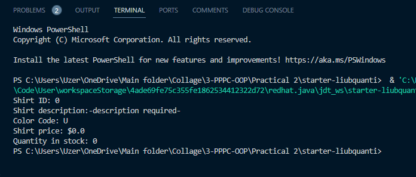
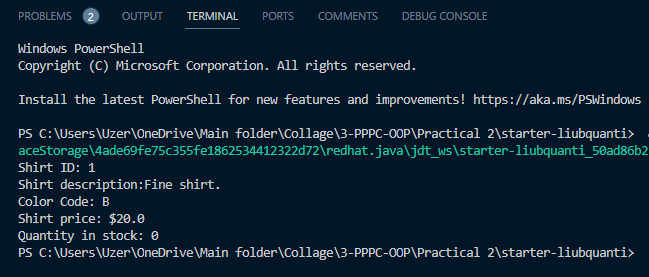

# Завдання 1

## Завдання 1.1

```java
public class Shirt {
  public int shirtID = 0;
  public String description = "-description required-";
  public char colorCode = 'U';
  public double price = 0.0;
  public int quantityInStock = 0;
  
  public void displayShirtInformation() {
    System.out.println("Shirt ID: " + shirtID);
    System.out.println("Shirt description:" + description);
    System.out.println("Color Code: " + colorCode);
    System.out.println("Shirt price: $" + price);
    System.out.println("Quantity in stock: " + quantityInStock);
  }
}
```



## Завдання 1.2

```java
public class Shirt {
  public int shirtID = 1;
  public String description = "Fine shirt.";

  public char colorCode = 'B';
  public double price = 20.0;
  public int quantityInStock = 0;

  public void displayShirtInformation() {
    System.out.println("Shirt ID: " + shirtID);
    System.out.println("Shirt description:" + description);
    System.out.println("Color Code: " + colorCode);
    System.out.println("Shirt price: $" + price);
    System.out.println("Quantity in stock: " + quantityInStock);
  }
}
```


