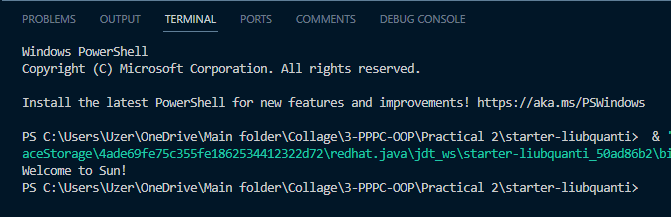
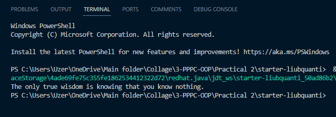

# Завдання 2

## Завдання 2.1

```java
public class Quotation {
    String quote = "Welcome to Sun!";

    public void display() {
        System.out.println(quote);
    }
}
```



## Завдання 2.2

```java
public class Quotation {
    String quote = "The only true wisdom is knowing that you know nothing.";

    public void display() {
        System.out.println(quote);
    }
}
```


