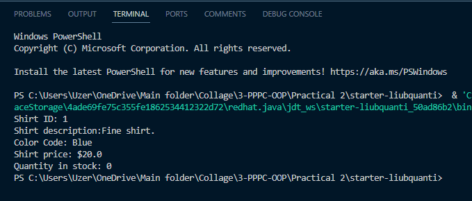

# Завдання 3

## Завдання 3.1

```java
public class Shirt {
  public int shirtID = 1;
  public String description = "Fine shirt.";

  public String colorCode = "Blue";
  public double price = 20.0;
  public int quantityInStock = 0;

  public void displayShirtInformation() {
    System.out.println("Shirt ID: " + shirtID);
    System.out.println("Shirt description:" + description);
    System.out.println("Color Code: " + colorCode);
    System.out.println("Shirt price: $" + price);
    System.out.println("Quantity in stock: " + quantityInStock);
  }
}
```



## Завдання 3.2

```java
public class Quotation {
    String quote = "The only true wisdom is knowing that you know nothing.";
    String name = "Socrates";

    public void display() {
        System.out.println(quote);
        System.out.println(name);
    }
}
```


